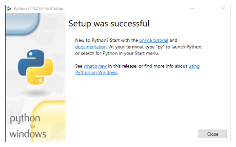
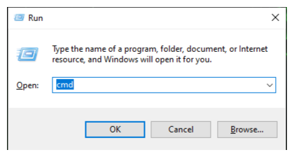

# Instalación de Python

Este este año en la materia utilizaremos la versión de **Python 3.10.9**.

En esta guía vamos a ver distintas formas de realizar la instalación de
la versión específica de **Python** que se utilizará en la cátedra para distintos
sistemas operativos.

## Instalación con manejador de versiones

La forma recomendable de instalar **Python** es por medio de un manejador de
versiones.

La idea de usar este tipo de herramientas son:

- Instalar prácticamente cualquier versión de **Python** que necesitemos.
- Permitir tener instaladas múltiples versiones.

Otro objetivo para esta cátedra es lograr que todos ustedes tengan exactamente
la misma versión de **Python**.

La herramienta que vamos a usar es [`pyenv`](https://github.com/pyenv/pyenv)

### Linux/MacOS

#### Dependencias necesarias

Para que `pyenv` puede realizar la instalación de las distintas versiones de `python`
de manera correcta es necesario contar algunas dependencias de su sistema operativo.

Estas dependencias son librerías que su sistema operativo necesita para que `pyenv`
pueda funcionar correctamente. Sin las mismas seguramente ocurran errores a la
hora de instalar o querer utilizar la herramienta.

Dependiendo del sistema operativo que utilicen deberán segir las instrucciones
en el siguiente enlace de la documentación de `pyenv` - [Suggested build
environment](https://github.com/pyenv/pyenv/wiki#suggested-build-environment).

#### Instalación con Git (RECOMENDADA)

Hacer el _checkout_ de `pyenv` en el directorio donde quieras que se instale.
Un buen lugar puede ser `$HOME/.pyenv`.

```bash
git clone https://github.com/pyenv/pyenv.git ~/.pyenv
```

Define la variable de entorno `PYENV_ROOT` para tener disponible el _path_ donde
fue clonado el repositorio y agrega `$PYENV_ROOT/bin` a la variable `$PATH` para
tener acceso al comando `pyenv` en la terminal.

```bash
echo 'export PYENV_ROOT="$HOME/.pyenv"' >> ~/.bash_profile
echo 'export PATH="$PYENV_ROOT/bin:$PATH"' >> ~/.bash_profile
```

!!! warning

    - Si usas **ZSH** modifica el comando con `~/.zshrc` en lugar de
    `~/.bash_profile`.
    - Para **Ubuntu** y **Fedora** usa `~/.bashrc` en lugar de
    `~/.bash_profile`.

Finalmente para terminar de configurarlo y tener el autocompletado en la consola
ejecuta el siguiente comando:

```bash
echo -e 'if command -v pyenv 1>/dev/null 2>&1; then\n  eval "$(pyenv init -)"\nfi' >> ~/.bash_profile
```

!!! warning

      Al igual que en el paso anterior reemplaza con `~/.zshrc` o `~/.bashrc` en
      el comando según corresponda.

Luego reiniciar la terminal para que tome los cambios.

!!! info

      Guía completa en el [README de pyenv](https://github.com/pyenv/pyenv).

#### Instalación con brew (solo MacOS)

Se puede instalar `pyenv` usando el manejador de paquetes
[Homebrew](https://brew.sh/) para MacOS.

```bash
brew update
brew install pyenv
```

### Windows

Para el caso de Windows existe una herramienta alternativa que nos permite
tener `pyenv` para este tipo de sistema operativo.

La herramienta es [`pyenv-win`](https://github.com/pyenv-win/pyenv-win)

#### Instalación con PowerShell

Utilizar **PowerShell** para la instalación en windows es la forma recomendada
en la [documentación de la herramienta](https://github.com/pyenv-win/pyenv-win#quick-start).

1. Instalar `pyenv-win` en PowerShell.
   ```pwsh
   Invoke-WebRequest -UseBasicParsing -Uri "https://raw.githubusercontent.com/pyenv-win/pyenv-win/master/pyenv-win/install-pyenv-win.ps1" -OutFile "./install-pyenv-win.ps1"; &"./install-pyenv-win.ps1"
   ```

2. Re abrir PowerShell
3. Correr `pyenv --version` para verificar si la instalación terminó
4. Corer `pyenv install -l` para verificar la lista de versiones de **Python**
   soportadas por `pyenv-win`
5. Correr `pyenv install <version>` para instalar la versión de **Python** que desea
6. Corer `pyenv global <version>` para setear esa versión de **Python** como global
7. Verifique que versión de **Python** está utilizando en su path
   ```plaintext
   > pyenv version
   <version> (set by \path\to\.pyenv\pyenv-win\.python-version)
   ```

8. Verifique que esa versión de **Python** está funcionando
   ```plaintext
   > python -c "import sys; print(sys.executable)"
   \path\to\.pyenv\pyenv-win\versions\<version>\python.exe
   ```

## Instalación directa

En este tipo de instalación se instala directamente el ejecutable de **Python**
en su sistema operativo.

Este tipo de instalación **no es la recomendable** dado que sólo nos permite
tener una sola versión de **Python** instalada sin problemas. En caso de
instalar más de una versión puede aparecer distintos tipos de conflictos.

### Linux/MacOS

Para estos sistemas operativos la instalación directa no es recomendable dado
que puede causar muchos conflictos con las versiones de instaladas en el
sistema operativo por defecto.

!!! warning

    Les recomendamos que utilicen un manejador de versiones para estos operativos.

### Windows

Estos son los enlaces para los ejecutables de Windows:

- [Instalador ejecutable para Windows 32bits](https://www.python.org/ftp/python/3.10.9/python-3.10.9.exe)
- [Instalador ejecutable para Windows 64bits](https://www.python.org/ftp/python/3.10.9/python-3.10.9-amd64.exe)

Si necesita alguna alternativa distinta pueda obtener más opciones en el
[siguiente enlace](https://www.python.org/downloads/release/python-3109/).

Al descargar el instalador debe ejecutarlo y seguir los pasos que ofrece.
La primer ventana que se puede visualizar el la siguiente:

<center>

</center>

Si es la primer versión de **Python** que instala se recomienda seguir la
instalación simple ("Install Now" en la imagen).

!!! warning

    Tener en cuenta de seleccionar el checkbox de abajo para agregar el
    ejecutable de **Python** al PATH del sistema. Esto es fundamental para
    poder ejecutar **Python** correctamente.

    

Si todo salió correctamente debería ver una imagen similar a esta:

<center>

</center>

#### Chequeo de variable de entorno

Para verificar si tenemos **Python** correctamente instalado vamos a hacer uso
de una terminal o consola de comandos.

Para abrir el `cmd` tenemos al menos las siguientes dos opciones:

- En el buscador de windows ponemos "cmd" y seleccionamos la primer opción.
<center>

</center>

- Presionamos las teclas `win` + `R`, ponemos "cmd", presionamos `enter`.
<center>

</center>

Para cualquiera de las opciones nos tiene que abrir la siguiente ventana:

<center>

</center>

Para verificar si la instalación de Python fué correcta vamos a ejecutar el intérprete interactivo de Python.
Lo podemos abrir escribiendo "python" en el cmd y prescionando la tecla `enter`.
Debería aparecer algo como esto:

<center>

</center>

En esta terminal interactiva ya podemos ejecutar código Python.

## Uso de `pyenv`

Para buscar que versión de **Python** queremos instalar podemos usar:

```bash
pyenv install 3.6.8
```

Ahora podemos seleccionar esta versión como global

```bash
pyenv global 3.6.8
```

o como versión local en el directorio que nos encontremos

```bash
pyenv local 3.6.8
```

Pueden encontrar la documentación completa del uso en la [documentación oficial
de la herramienta](https://github.com/pyenv/pyenv#usage).